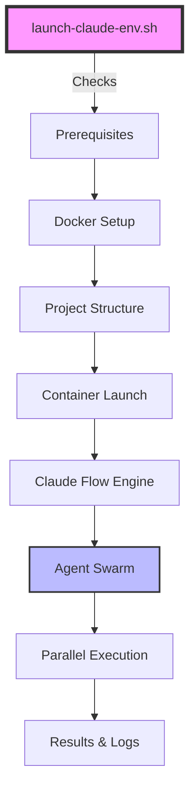

# Claude Flow Swarm Launcher 🚀


> **Transform complex objectives into coordinated AI agent swarms with a single command.**

A self-contained, zero-configuration script that launches a powerful, containerised AI agent swarm on your local machine. Watch as a team of specialised AI agents work in parallel to achieve your development goals. This is JUST a container launcher for [Reuven Cohen's orchestrator](https://www.linkedin.com/feed/update/urn:li:activity:7338263351153610753/) which itself leverages [Claude Code CLI](https://docs.anthropic.com/en/docs/claude-code/cli-reference), and took me no more than an hour to make, the credit is all theirs. 

[Here's the Claude Code Flow repo](https://github.com/ruvnet/claude-code-flow)

---

<p align="center">
  
  <br>
  <em>Watch the swarm analyse, plan, code, and review in real-time</em>
</p>

## 🎯 What is This?

The Claude Flow Swarm Launcher is your command-line interface to the future of AI-assisted development. It's the ignition key for the **[claude-flow](https://github.com/ruvnet/claude-code-flow)** engine, designed to work seamlessly within **Claude Code** or any local development environment.

### 🤖 What Can It Do?

Give it a project and an objective, and watch as it:
- **📋 Plans** - Creates a detailed execution strategy
- **🔍 Researches** - Analyses your codebase and gathers context
- **⚡ Executes** - Multiple agents work in parallel on different aspects
- **✅ Reviews** - Self-reviews code quality and consistency
- **📚 Documents** - Keeps documentation synchronised with changes

## ✨ Key Features

### 🚀 **Zero-Configuration Setup**
Automatically generates everything you need - Dockerfile, configuration files, and directory structure. Just run and go.

### 📦 **Fully Containerised**
Runs in an isolated Docker environment with GPU support. Your system stays clean, and the swarm gets all the resources it needs.

### 🧠 **Intelligent Model Selection**
```
Opus (Powerful) ──┐
                  ├── Auto-fallback System
Sonnet (Fast) ────┘
```
Automatically attempts the powerful Claude 3 Opus model, gracefully falling back to the efficient Claude 3.5 Sonnet if needed.

### 📁 **Clean Project Organisation**
```
your-project/
├── src/
├── tests/
├── README.md
└── .claude-flow-swarm/      # All swarm files here
    ├── claude-flow.config.json
    ├── README.md
    └── claude-swarm-*.log
```

### 🔄 **Smart Session Management**
Already running a swarm? The launcher detects it and reattaches automatically. No duplicate processes, no confusion.

### 📝 **Comprehensive Logging**
Every swarm run is fully logged with timestamps, making debugging and progress tracking straightforward.

## 🏁 Quick Start

### Prerequisites

1. **🐳 Docker** - [Install Docker](https://docs.docker.com/get-docker/)
   ```bash
   docker --version  # Verify installation
   ```

2. **🔑 Claude API Access**
   - Requires a Claude API key (Pro/Team subscription)
   - You'll configure this securely in the container environment

### Installation

1. **Download the launcher script**
   ```bash
   wget https://raw.githubusercontent.com/your-repo/launch-claude-env.sh
   # or
   curl -O https://raw.githubusercontent.com/your-repo/launch-claude-env.sh
   ```

2. **Make it executable**
   ```bash
   chmod +x launch-claude-env.sh
   ```

3. **Launch your first swarm!**
   ```bash
   ./launch-claude-env.sh my-project "Refactor the authentication system for better security"
   ```

## 📖 Usage Guide

### Basic Syntax
```bash
./launch-claude-env.sh <project_name> "<objective>" [mode] [model]
```

### Parameters

| Parameter | Type | Description | Default |
|-----------|------|-------------|---------|
| `project_name` | Required | Name of your project directory | - |
| `objective` | Required | What you want the swarm to achieve (quoted) | - |
| `mode` | Optional | `auto` or `shell` | `auto` |
| `model` | Optional | `opus`, `sonnet`, or `auto-fallback` | `auto-fallback` |

### Execution Modes

#### 🤖 **Auto Mode** (default)
Runs the swarm non-interactively. Perfect for CI/CD pipelines or when you know exactly what you want.
```bash
./launch-claude-env.sh my-app "Add comprehensive test coverage"
```

#### 🖥️ **Shell Mode**
Drops you into an interactive shell inside the container for manual control and exploration.
```bash
./launch-claude-env.sh my-app "Debug environment" shell
```

### Model Selection

#### 🧠 **Auto-Fallback** (default)
Intelligently tries Opus first for complex tasks, automatically falling back to Sonnet if needed.

#### ⚡ **Opus**
Forces use of Claude 3 Opus - best for complex reasoning and large-scale refactoring.
```bash
./launch-claude-env.sh my-app "Redesign the entire architecture" auto opus
```

#### 🏃 **Sonnet**
Forces use of Claude 3.5 Sonnet - faster and more efficient for straightforward tasks.
```bash
./launch-claude-env.sh my-app "Update dependencies" auto sonnet
```

## 🎨 Real-World Examples

### 🔧 Complete Refactoring
```bash
./launch-claude-env.sh legacy-api \
  "Analyse this Express.js API and refactor it to use modern TypeScript, \
   add proper error handling, implement dependency injection, \
   and ensure 100% type safety"
```

### 📚 Documentation Generation
```bash
./launch-claude-env.sh my-library \
  "Generate comprehensive documentation including API reference, \
   tutorials, and examples. Create a documentation site structure \
   using MkDocs"
```

### 🧪 Test Suite Creation
```bash
./launch-claude-env.sh backend-service \
  "Create a complete test suite with unit tests, integration tests, \
   and E2E tests. Aim for 90% code coverage. Use Jest and Supertest"
```

### 🔒 Security Audit
```bash
./launch-claude-env.sh web-app \
  "Perform a security audit, identify vulnerabilities, \
   implement fixes, and add security best practices"
```

### 🎯 Feature Implementation
```bash
./launch-claude-env.sh saas-platform \
  "Research WebSocket best practices, then implement a real-time \
   notification system with Redis pub/sub for scalability"
```

## 🏗️ Architecture



## 🔧 Configuration

### Default Configuration
The script creates a sensible default `claude-flow.config.json` in your project's `.claude-flow-swarm/` directory:

```json
{
  "orchestrator": {
    "maxConcurrentAgents": 10,
    "agentTimeoutMs": 900000,
    "resourceAllocationStrategy": "balanced"
  },
  "swarm": {
    "strategy": "development",
    "maxAgents": 5,
    "parallel": true
  }
}
```

### Customisation Options

| Setting | Description | Values |
|---------|-------------|--------|
| `maxConcurrentAgents` | Maximum parallel agents | 1-20 |
| `agentTimeoutMs` | Timeout per agent task | milliseconds |
| `strategy` | Swarm behaviour preset | `development`, `research`, `review` |
| `temperature` | AI creativity level | 0.0-1.0 |

## 🛡️ Security Considerations

### API Key Management
- **Never** hardcode API keys in the script
- Use environment variables or Docker secrets
- The script will remind you about API key requirements but won't handle them

### Recommended Approach
```bash
# Create a .env file (don't commit this!)
echo "ANTHROPIC_API_KEY=your-key-here" > .env

# Modify docker run command to include:
--env-file .env
```

## 🐛 Troubleshooting

### Common Issues

<details>
<summary><strong>Docker daemon not running</strong></summary>

```bash
# Linux
sudo systemctl start docker

# macOS/Windows
# Start Docker Desktop application
```
</details>

<details>
<summary><strong>Permission denied</strong></summary>

```bash
# Make script executable
chmod +x launch-claude-env.sh

# Or run with bash
bash launch-claude-env.sh
```
</details>

<details>
<summary><strong>Container already exists</strong></summary>

The script automatically detects and reattaches to existing sessions. To force a new session:
```bash
docker stop claude-swarm-session-your-project
docker rm claude-swarm-session-your-project
```
</details>

<details>
<summary><strong>API key issues</strong></summary>

Check that your API key is properly configured:
- Valid and active subscription
- Correctly set in environment
- No extra spaces or quotes
</details>

### 📋 Logs and Debugging

All execution logs are stored in:
```
your-project/.claude-flow-swarm/claude-swarm-YYYYMMDD-HHMMSS.log
```

View logs in real-time:
```bash
tail -f your-project/.claude-flow-swarm/claude-swarm-*.log
```

## 🤝 Contributing

We welcome contributions! Here's how you can help:

1. 🐛 **Report bugs** - Open an issue with reproduction steps
2. 💡 **Suggest features** - Share your ideas in discussions
3. 🔧 **Submit PRs** - Fork, branch, and submit pull requests
4. 📚 **Improve docs** - Help make this README even better
5. ⭐ **Star the project** - Help others discover it

## 📄 License

This project is licensed under the MIT License - see the [LICENSE](LICENSE) file for details.

## 🙏 Acknowledgements

- The [claude-flow](https://github.com/ruvnet/claude-code-flow) team for the powerful engine
- The Claude team at Anthropic for the incredible AI models
- The open-source community for continuous inspiration

---

<p align="center">
  <strong>Ready to revolutionise your development workflow?</strong><br>
  <a href="#-quick-start">Get Started</a> •
  <a href="https://github.com/your-repo/issues">Report Issue</a> •
  <a href="https://github.com/your-repo/discussions">Join Discussion</a>
</p>
