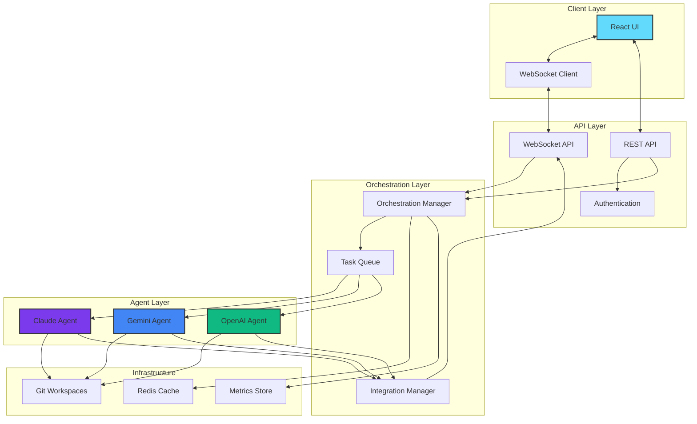
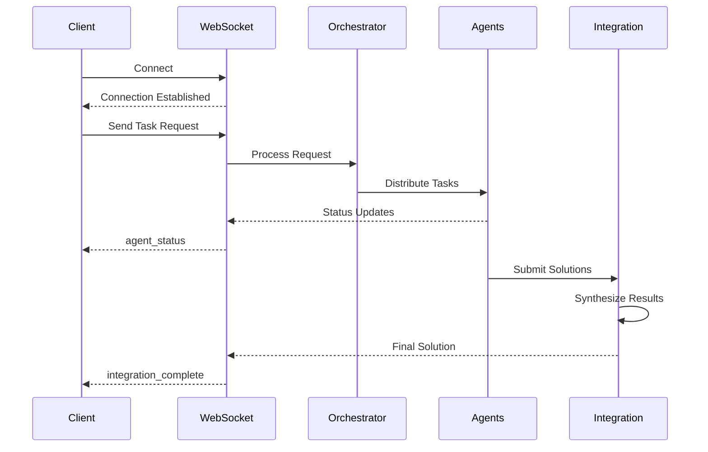
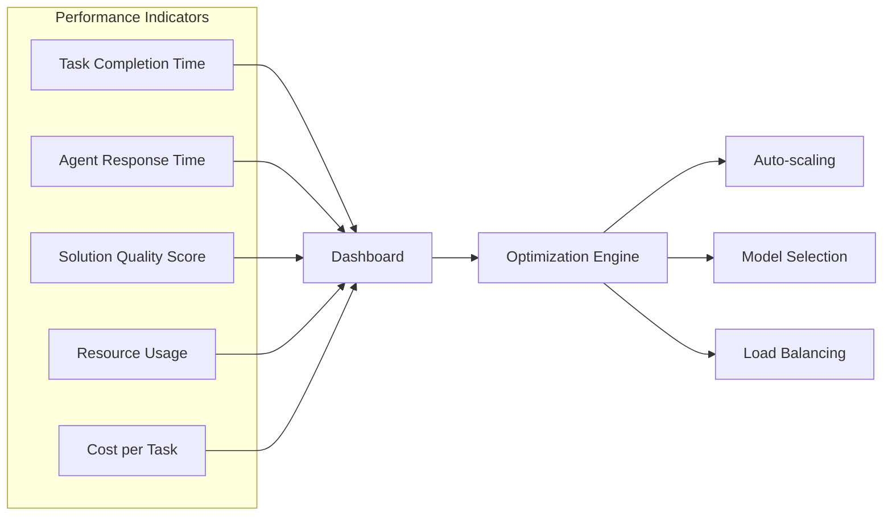
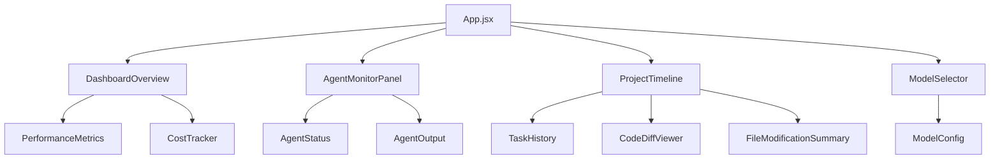
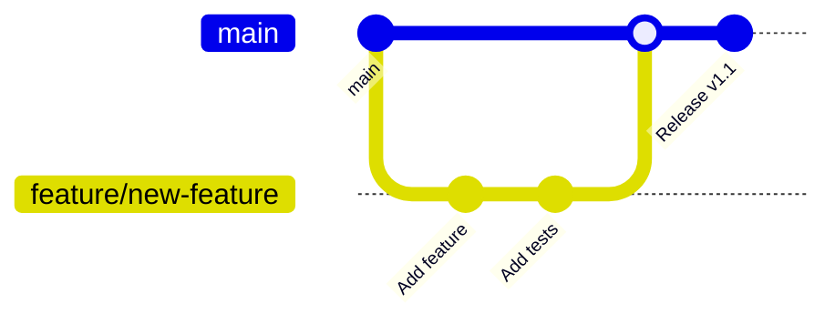

# Claude Swarm Launcher 🚀

<div align="center">


**A sophisticated multi-agent orchestration platform that coordinates Claude, Gemini, and OpenAI agents to collaboratively solve complex software engineering tasks through parallel execution and intelligent solution synthesis.**

[Live Demo](https://yourdemo.com) • [Documentation](https://docs.yourdomain.com) • [Report Bug](https://github.com/yourusername/Claude-Swarm-Launcher/issues) • [Request Feature](https://github.com/yourusername/Claude-Swarm-Launcher/issues)

</div>

---

## 🌟 Key Features

<table>
<tr>
<td>

### 🤖 Multi-Agent Orchestration
- Parallel execution of Claude, Gemini, and OpenAI agents
- Intelligent task distribution and workload balancing
- Real-time agent collaboration and communication

</td>
<td>

### 🔄 Smart Integration
- Automatic solution synthesis from multiple agents
- Conflict resolution and consensus building
- Best-practice extraction from diverse approaches

</td>
</tr>
<tr>
<td>

### 📊 Real-Time Monitoring
- WebSocket-based live agent status updates
- Performance metrics and cost tracking
- Interactive timeline visualization

</td>
<td>

### 🛡️ Robust Architecture
- Git-based workspace isolation
- Automatic error recovery and retry logic
- Docker containerization for easy deployment

</td>
</tr>
</table>

## 🏗️ System Architecture



## 🚀 Quick Start

### Prerequisites

<details>
<summary>System Requirements</summary>

- **Docker**: 20.10+ with Docker Compose
- **Node.js**: 20+ LTS (for local development)
- **Python**: 3.11+ (for local development)
- **Git**: 2.30+
- **Memory**: 8GB RAM minimum
- **Storage**: 10GB available space

</details>

### 🐳 Docker Installation (Recommended)

```bash
# Clone the repository
git clone https://github.com/yourusername/Claude-Swarm-Launcher.git
cd Claude-Swarm-Launcher

# Configure environment
cp .env.example .env
nano .env  # Add your API keys

# Launch with Docker Compose
docker-compose up -d

# View logs
docker-compose logs -f
```

The application will be available at `http://localhost:8100`

### 💻 Local Development Setup

<details>
<summary>Backend Setup</summary>

```bash
# Navigate to backend
cd backend

# Create virtual environment
python -m venv venv
source venv/bin/activate  # On Windows: venv\Scripts\activate

# Install dependencies
pip install -r requirements.txt

# Run development server
uvicorn main:app --reload --port 8000
```

</details>

<details>
<summary>Frontend Setup</summary>

```bash
# Navigate to frontend
cd frontend

# Install dependencies
npm install

# Run development server
npm run dev
```

</details>

<details>
<summary>AI CLI Tools Installation</summary>

```bash
# Install required CLI tools globally
npm install -g @anthropic/claude-cli @google/gemini-cli openai-cli

# Verify installations
claude --version
gemini --version
openai --version
```

</details>

## 🔧 Configuration

### Environment Variables

Create a `.env` file with the following variables:

```env
# API Keys (Required)
ANTHROPIC_API_KEY=your_claude_api_key
GEMINI_API_KEY=your_gemini_api_key
OPENAI_API_KEY=your_openai_api_key

# Model Configuration (Optional)
CLAUDE_MODEL=claude-3-5-sonnet-20241022
GEMINI_MODEL=gemini-2.5-pro
OPENAI_MODEL=gpt-4o-mini

# Server Configuration
PORT=8100
HOST=0.0.0.0
DEBUG=false

# Performance Tuning
MAX_CONCURRENT_AGENTS=3
AGENT_TIMEOUT=300
RETRY_ATTEMPTS=3
```

### Advanced Configuration

<details>
<summary>Model Selection Matrix</summary>

| Use Case | Claude Model | Gemini Model | OpenAI Model |
|----------|-------------|--------------|--------------|
| Code Generation | claude-3-5-sonnet | gemini-2.5-pro | gpt-4o |
| Quick Tasks | claude-3-haiku | gemini-2.5-flash | gpt-4o-mini |
| Complex Analysis | claude-3-opus | gemini-2.5-pro | gpt-4 |

</details>

## 📡 API Reference

### WebSocket API



#### Request Format

```typescript
interface TaskRequest {
  prompt: string;
  config?: {
    models?: {
      claude?: string;
      gemini?: string;
      openai?: string;
    };
    timeout?: number;
    retries?: number;
  };
  context?: {
    files?: string[];
    previousTaskId?: string;
  };
}
```

#### Response Types

```typescript
type WebSocketMessage = 
  | { type: 'agent_status'; agent: string; status: string; progress: number }
  | { type: 'agent_output'; agent: string; output: string; timestamp: string }
  | { type: 'integration_complete'; solution: string; metrics: object }
  | { type: 'error'; message: string; code: string };
```

### REST Endpoints

| Endpoint | Method | Description |
|----------|--------|-------------|
| `/` | GET | Health check |
| `/docs` | GET | Swagger documentation |
| `/api/tasks` | GET | List all tasks |
| `/api/tasks/{id}` | GET | Get task details |
| `/api/agents/status` | GET | Agent status overview |
| `/api/metrics` | GET | Performance metrics |

## 🧪 Testing

```bash
# Run unit tests
python -m pytest tests/unit -v

# Run integration tests
python -m pytest tests/integration -v

# Run end-to-end tests
python test_agents.py

# Generate coverage report
python -m pytest --cov=backend --cov-report=html
```

## 📊 Performance Metrics



## 🛠️ Development

### Project Structure

```
Claude-Swarm-Launcher/
├── backend/
│   ├── agents/              # Agent implementations
│   │   ├── base_agent.py    # Abstract base class
│   │   ├── claude_agent.py  # Claude integration
│   │   ├── gemini_agent.py  # Gemini integration
│   │   └── codex_agent.py   # OpenAI integration
│   ├── api/                 # API endpoints
│   ├── core/                # Core orchestration logic
│   ├── utils/               # Utility functions
│   └── main.py              # FastAPI application
├── frontend/
│   ├── src/
│   │   ├── components/      # React components
│   │   ├── hooks/           # Custom React hooks
│   │   ├── services/        # API services
│   │   └── App.jsx          # Main application
│   └── public/              # Static assets
├── tests/                   # Test suites
├── docker/                  # Docker configurations
└── docs/                    # Documentation
```

### Adding New Agents

1. Create a new agent class:

```python
from backend.agents.base_agent import BaseAgent

class YourAgent(BaseAgent):
    def __init__(self, api_key: str, model: str):
        super().__init__("your-agent", api_key, model)
    
    async def execute(self, prompt: str) -> dict:
        # Implement agent logic
        pass
```

2. Register in orchestrator:

```python
# In backend/main.py
from backend.agents.your_agent import YourAgent

agents.append(YourAgent(api_key, model))
```

### UI Component Architecture



## 🚨 Troubleshooting

<details>
<summary>Common Issues and Solutions</summary>

### API Key Errors
```bash
# Verify API keys are set
cat .env | grep API_KEY

# Test individual agents
python -c "from backend.agents.claude_agent import ClaudeAgent; agent = ClaudeAgent('key', 'model'); print(agent.test_connection())"
```

### Port Conflicts
```yaml
# In docker-compose.yml, change ports:
services:
  app:
    ports:
      - "8200:8100"  # Change 8200 to any available port
```

### WebSocket Connection Issues
```javascript
// Check browser console for errors
// Verify WebSocket URL matches your server
const ws = new WebSocket('ws://localhost:8100/ws');
```

### Memory Issues
```bash
# Increase Docker memory limit
docker-compose down
# Edit docker-compose.yml to add memory limits
docker-compose up -d
```

</details>

## 🤝 Contributing

We welcome contributions! Please see our [Contributing Guide](CONTRIBUTING.md) for details.

### Development Workflow



## 📄 License

This project is licensed under the MIT License - see the [LICENSE](LICENSE) file for details.

## 🙏 Acknowledgments

- [Anthropic](https://anthropic.com) for Claude API
- [Google](https://ai.google.dev) for Gemini API
- [OpenAI](https://openai.com) for GPT API
- All contributors and community members

---

<div align="center">

Made with ❤️ by the Claude Swarm community

[⬆ Back to Top](#claude-swarm-launcher-)

</div>