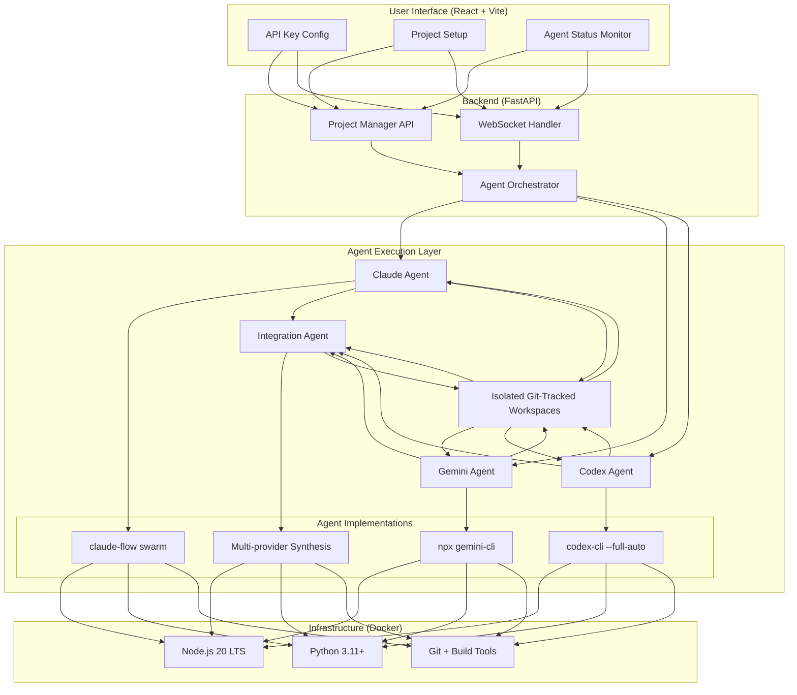

# AI Agent Swarm: Upgrade and Migration Plan

### 1. Introduction

The objective of this plan is to evolve the AI Agent Swarm system from its current prototype state to the full-featured, robust application described in the `README.md`. This document outlines a phased approach to implementing missing features, refactoring the existing codebase to align with the target architecture, and ensuring the system meets all functional and non-functional requirements.

### 2. Current State Analysis

The current system successfully demonstrates a proof-of-concept with a FastAPI backend, a React frontend, and parallel agent execution via WebSockets. However, it deviates from the `README.md` in several critical areas:

*   **Incorrect Agent Commands**: The commands used to invoke the Gemini and Codex agents in `backend/main.py` are incorrect and do not match the instructions in the `README.md`.
*   **Monolithic Backend Logic**: All backend logic is contained within a single file (`main.py`), lacking the modular, class-based agent structure specified in the architecture.
*   **Missing Core Features**: Key features like a `BaseAgent` class, advanced integration logic, robust error handling, and workspace management are not implemented.
*   **Incomplete Docker Configuration**: The `Dockerfile` is missing required npm packages for the agents to function as described.
*   **UI/UX Gaps**: The frontend is functional but lacks the enhanced monitoring and configuration features detailed in the `README.md`.
*   **No Formal Documentation**: The project currently has no formal API documentation.

### 3. Target Architecture

The migration will align the codebase with the following architecture, as described in the `README.md`:

### 4. Detailed Migration Plan

This plan follows the structure of the `Migration TODO List` in the `README.md`.

---

#### **Phase 1: Fix Agent Implementations (Priority: HIGH)**

*   **Objective**: Ensure all agents are invoked correctly with the proper commands and configurations.
*   **Current State**: Agent commands in `backend/main.py` are incorrect placeholders.
*   **Action Items**:
    1.  **Modify `Dockerfile`**:
        *   In `agent-swarm-ui/Dockerfile`, replace `codex-cli` with `@openai/codex` to match the `README.md`'s migration plan.
    2.  **Modify `backend/main.py`**:
        *   Update the `run_agent` call for Gemini to use `npx https://github.com/google-gemini/gemini-cli "{prompt}"`.
        *   Update the `run_agent` call for Codex to use `codex --full-auto "{prompt}"`.
    3.  **Modify `frontend/src/App.jsx`**:
        *   Update the default model for Claude in the `agentModels` state to `claude-3-5-sonnet-20240620` as per the TODO list's intent.
        *   Update the default model for Codex to `o4-mini`.
        *   Update the model selection dropdowns to reflect the models available in the `README.md`'s "Model Selection Guide".

---

#### **Phase 2: Add Missing Base Agent Features (Priority: HIGH)**

*   **Objective**: Refactor the backend to use a modular, object-oriented structure for agents and implement proper workspace isolation.
*   **Current State**: No `BaseAgent` class exists. Workspace creation is basic and lacks cleanup or git tracking.
*   **Action Items**:
    1.  **Create `backend/agents/base_agent.py`**:
        *   Create a new file for the abstract base class `BaseAgent`.
        *   Implement methods for `execute`, `status_update`, `log`, `_run_command`, and properties for timing, retry logic, and timeout handling as specified in the `README.md`.
    2.  **Create Agent-Specific Classes**:
        *   Create `backend/agents/claude_agent.py`, `gemini_agent.py`, and `codex_agent.py`, with each class inheriting from `BaseAgent`.
    3.  **Refactor `backend/main.py`**:
        *   Replace the `run_agent` function with an orchestration loop that instantiates and runs the new agent classes.
    4.  **Implement Workspace Management**:
        *   In the `BaseAgent` or a new `WorkspaceManager` class, add logic to `git init` within each agent's sandbox.
        *   Add a `cleanup()` method to be called after execution to remove the sandbox directories.

---

#### **Phase 3 & 4: Enhance Integration & Error Handling (Priority: MEDIUM)**

*   **Objective**: Upgrade the integration logic from a simple prompt to a sophisticated synthesis process and implement system-wide resiliency.
*   **Current State**: Integration is a single call to Gemini. Error handling is limited to streaming stderr.
*   **Action Items**:
    1.  **Create `backend/agents/integration_agent.py`**:
        *   Implement logic to perform a `git diff` on each agent's sandbox to identify changes.
        *   Add methods for code quality analysis (e.g., linting, complexity checks).
        *   Implement a basic conflict resolution strategy (e.g., "Claude's version is the baseline, apply non-conflicting changes from others").
    2.  **Improve Error Handling**:
        *   In the `BaseAgent` class, wrap the `_run_command` call in a try/except block.
        *   Implement retry logic with exponential backoff for command execution failures.
        *   In the orchestrator logic in `main.py`, catch exceptions from agent execution and allow other agents to continue (graceful degradation).

---

#### **Phase 5: UI, Docs, & DevOps (Priority: LOW to MEDIUM)**

*   **Objective**: Improve the user experience, and make the system deployable and maintainable.
*   **Action Items**:
    1.  **Frontend Improvements (LOW)**:
        *   In `frontend/src/App.jsx`, enhance the `AgentPanel` component to include progress bars and diff viewers.
    2.  **Documentation (MEDIUM)**:
        *   Add OpenAPI/Swagger documentation to the FastAPI app in `main.py`.
    3.  **DevOps (LOW)**:
        *   Create a `docker-compose.yml` file as described in the `README.md` to simplify local startup.